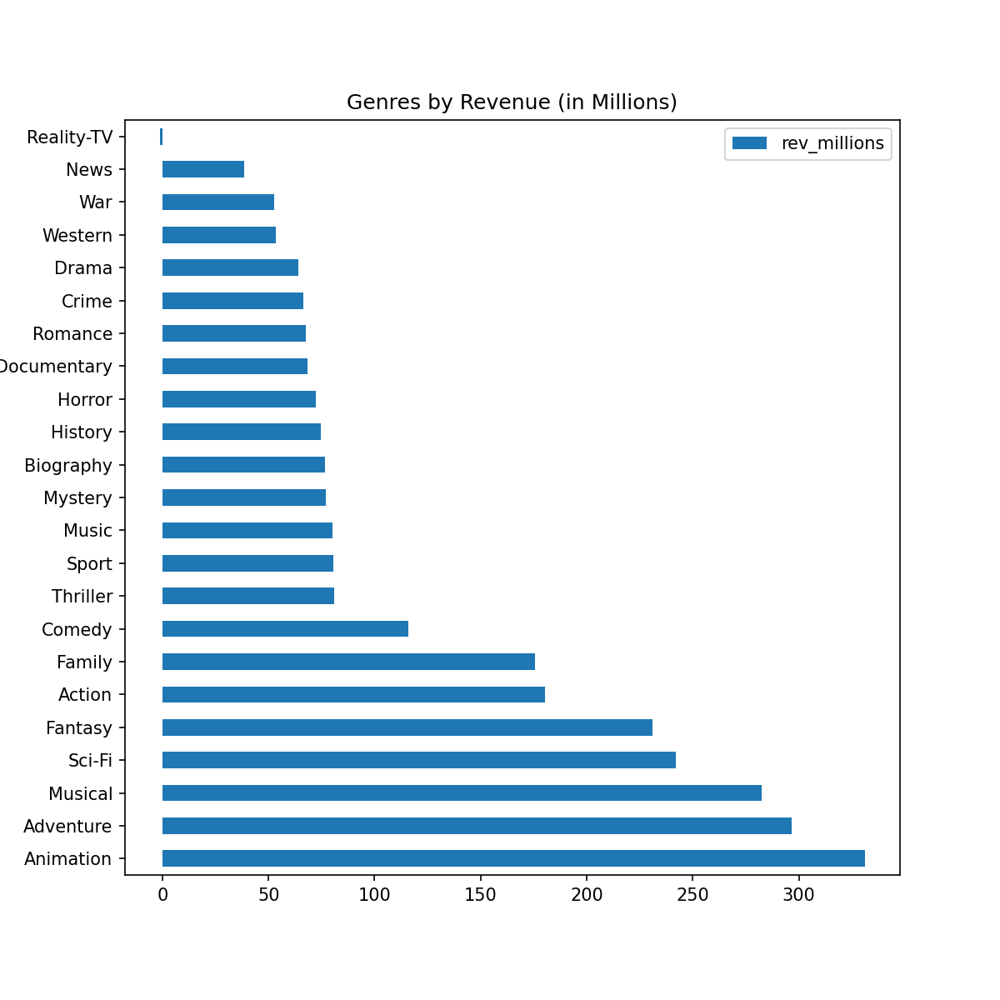
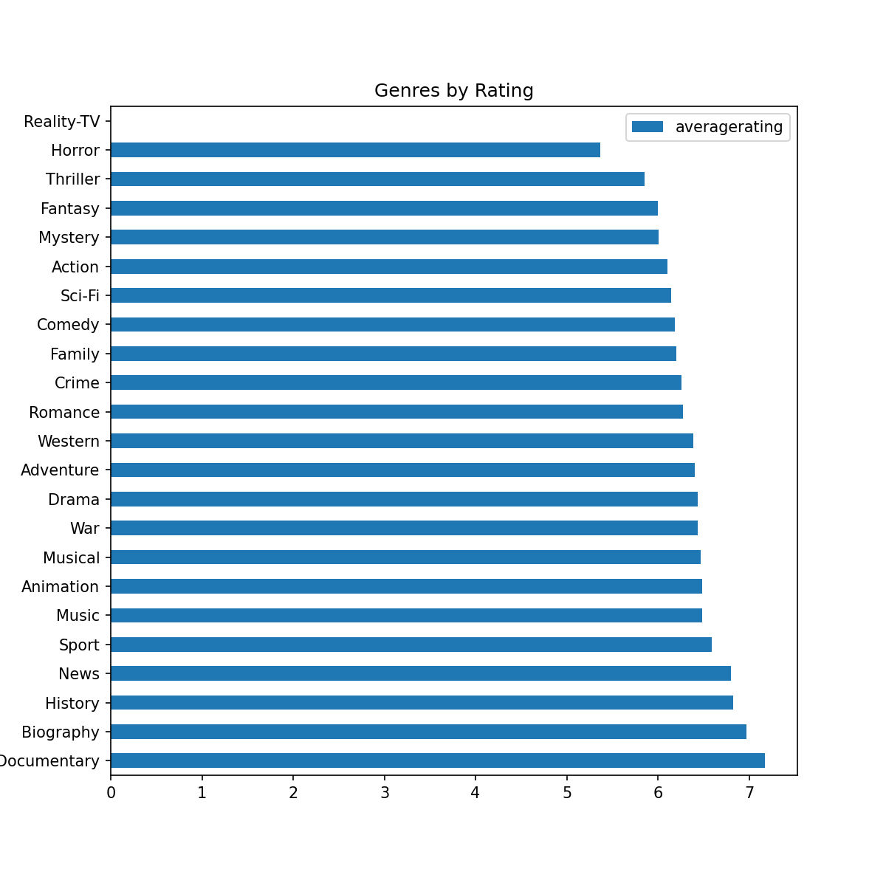
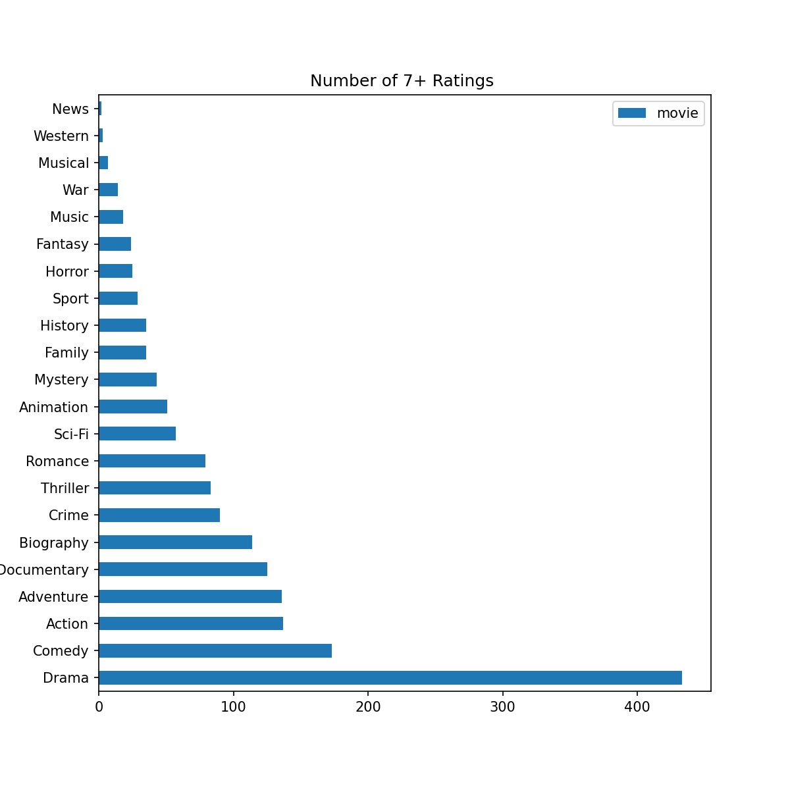
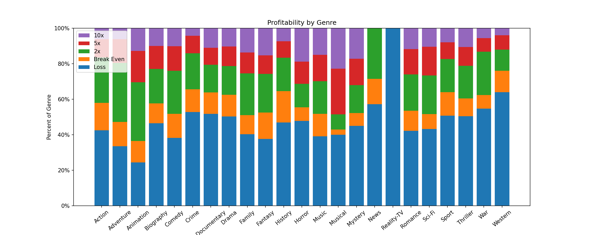

# Microsoft Movie Analysis

**Authors**: Christopher Varghese

## Overview

This analysis will use data samples to study the correlation between movie genre and revenue, ratings, and profitability to help give insight to Microsoft's new movie studio in their endeavor to compete in this industry. By approaching the movie industry from the various angles by which movies are deemed to be success, this analysis presents some insight on which genres to pursue and how to go about them. By analyzing revenue and probability of profitability, this analysis strives to ensure that this new movie studio is generating a positive revenue rather than a deficit. Additionally, by exploring the impact of ratings and its correlation to genre, it will be easier for this movie studio to create a impactful, global reputation as a premier film making service.

## Business Problem

Creating a movie can be a very risky investment, especially with little knowledge of the statistics of the industry. Since movies are heavily time and capital consuming, it is of utmost importance to carefully plan out business strategies in order to be successful. Questions such as, "What genres create the most revenue and have the highest probability of generating profit?" and "Which genres will be best to accumulate the most and highest ratings?" are relevant to this analysis and for the success of the Microsoft Movie Studio.

## Data

IMDb Data: This data is pulled from IMDb's various datasets. There are four datasets that we are looking at which include the movie titles, ratings, crew members, and names for all crew members used. The first three data sets are linked by the alphanumeric code given for each unique movie title and the fourth data set will be used to find the names corrosponding to the aphanumeric code used for directors and writers of these films.

TN Data: This data includes movie titles, dates, and most importantly, the production budget, domestic gross, and international gross. This is essential for analzying the financial side of these movies.

## Methods

Genres are a very important category of movies since individuals have prefrences for different genres. Additionally, each genre may have varying budgets, ratings, revenue, etc. I utilized descriptive analysis including horizontal bar charts and stacked frequency charts. This provides an insightful overview of the relationship of genres with various features that are used to quantify the sucess of a movie.

## Results

### Genres ranked by Revenue(1)

Now that we have some understanding of how profit varies by genre, this graph gives actionable insight into the correlation between profit and genre. By taking the average revenue and categorzing it by the genre, it helps to show which genres will yield the most profit. This is important for a budding movie studio since generating capital is a primary focus for the business.



### Genres ranked by Average Rating(2)

Understanding the relationship between genres and ratings required multiple graphings. In the first graph, since the average ratings were so close by genre, the visual was helpful but was not insightful enough to make any reccomendations. In the second graph, by tallying the amount of ratings that were above average(near the averages of the first graph) I was able to better depict how certain genres recieve better reviews. Although the genres that are the most profitable and most highly rated do not align, it is important to consider both as high ratings for a studio will likely generate viewership for all media created by that studio.



### Number of Ratings over 7.0 by Genre(3)



### Profitability Spread by Genre(4)

This analysis takes a deeper look into the individual genres and determines what percentages of the movies are highly profitable to a loss. This bar chart helps to almost determine a probability of success since it showcases how many of the movies flopped, did okay, and did extremely well.



## Conclusions

My analysis leaves 3 main considerations for Microsoft's Movie Studio to consider.

**Microsoft should focus on creating titles in Animation, Adventure, and Musicals to yield the highest profits.** The top 5 most profitable genres on average are Animation, Adventure, Musical, Sci-Fi, and Fantasy. By focusing on at least the top 3 of these genres, Microsoft has a very high chance of at least recouping their initial investments as well as generating capital to expanding their studio and its productions.

**Microsoft should focus on creating titles in Drama and Comedy to ensure high ratings.** While the quality of a production will correlate to its ratings, the statistics show that drama and comedy rake in the highest ratings by far. By exploring these genres, Microsoft is sure to engage their viewers and recieve high ratings which will translate to increased viewership and recognition for their studio.

**When considering the portfolio of Microsofts Studio's productions, they should try to limit most of their work to Action, Adventure, History, and Animation, and stay away from Reality TV, and Horror.** The first few genres have high ratios of Generating a profit when compared to their probability of flopping. The last two are the opposite.

### Next Steps

Further study can be conducted to create even more actionable insights

**Further study on correlation between genres** This would allow the studio to narrow down even more conslusively what kind of pieces they would like to create.

**Further study on key players in the industry** By analyzing reviews of actors and directors as well as other data specific to many role players in the film business, the studio may be able to focus on recruiting casts with the highest chance of success

**Data on Production Time** Along with monetary costs, the amount of time needed to produce various pieces is valuable insight in choosing which film types are the smartest business decisions to pursue.

## For More Information

Please review our full analysis in [our Jupyter Notebook](./dsc-phase1-project-template.ipynb) or our [presentation](./DS_Project_Presentation.pdf).

For any additional questions, please contact **Christopher Varghese, chrisvarghese2000@gmail.com**

## Repository Structure

Describe the structure of your repository and its contents, for example:

```
├── README.md                           <- The top-level README for reviewers of this project
├── dsc-phase1-project-template.ipynb   <- Narrative documentation of analysis in Jupyter notebook
├── DS_Project_Presentation.pdf         <- PDF version of project presentation
├── data                                <- Both sourced externally and generated from code
└── images                              <- Both sourced externally and generated from code
```
